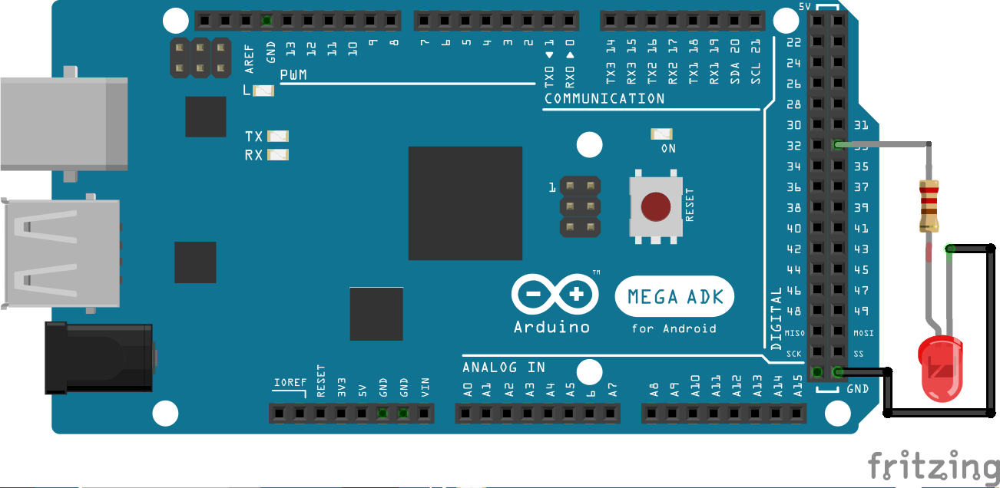
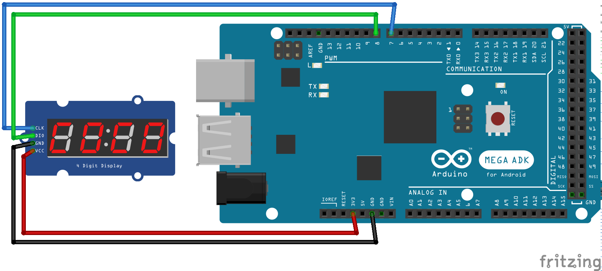
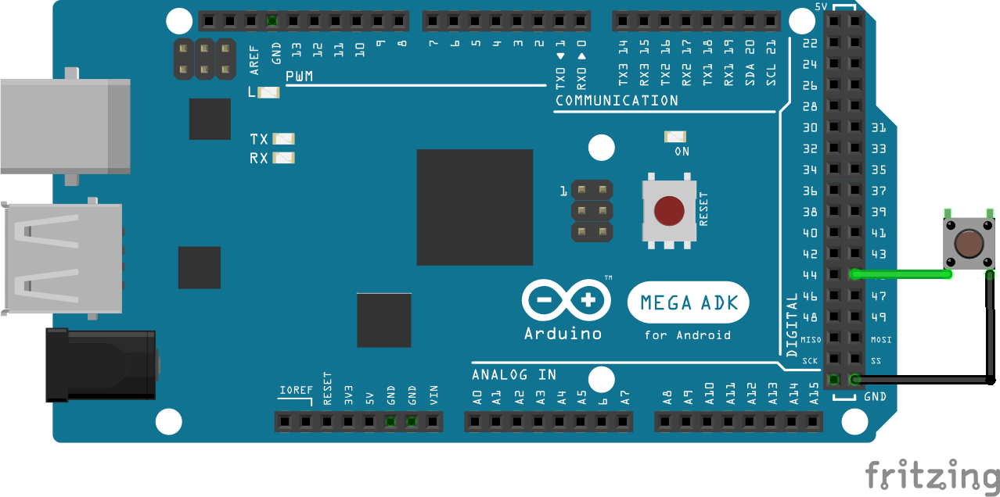
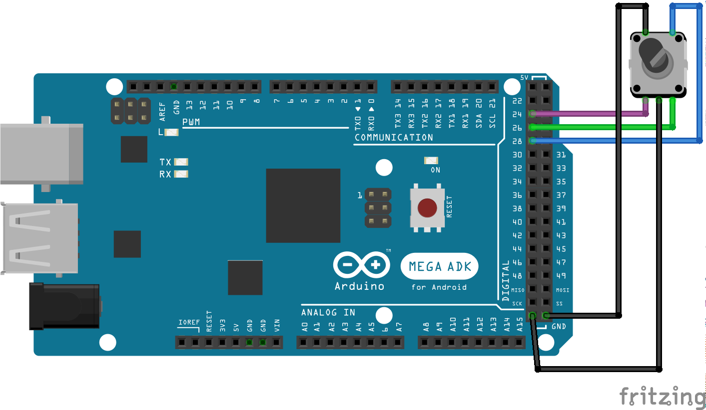
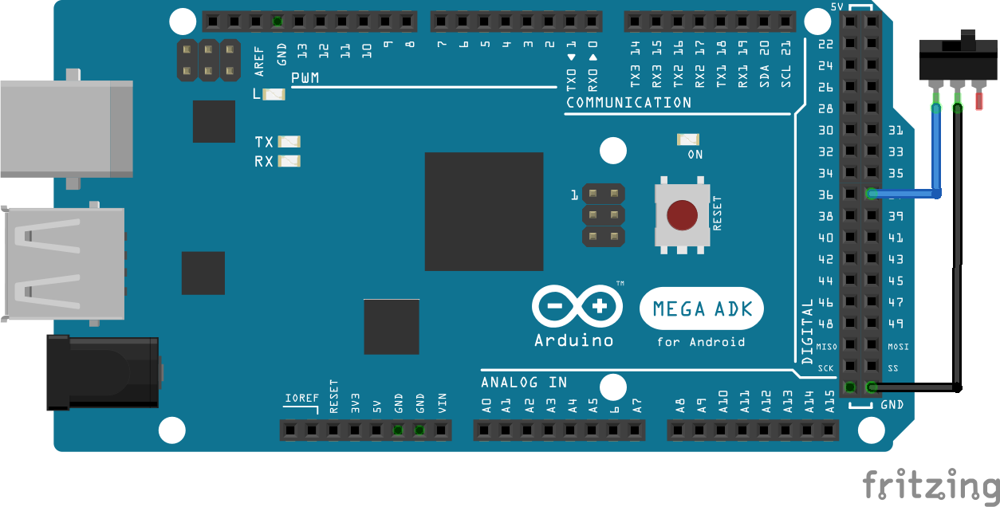
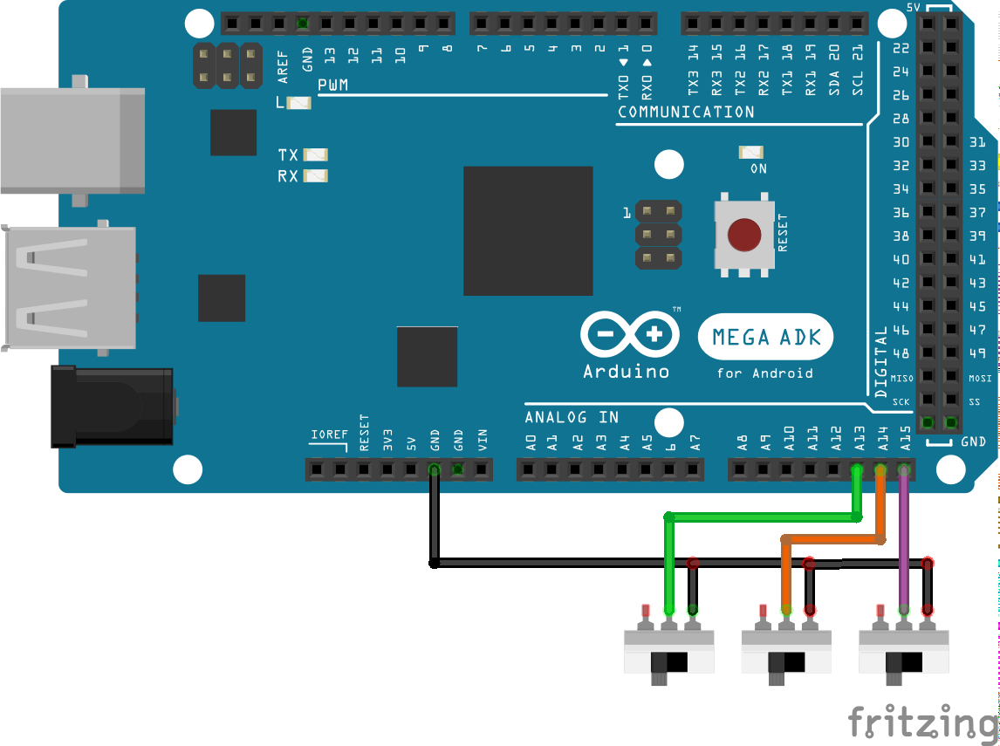

[](https://codecov.io/gh/xavi-garcia-mena/spaduino)

# Spaduino

This project is an experiment to create controls for Flight Simulator using [Spad.Next](https://www.spadnext.com).

It is based on the [Serial Interface (Version 1)](https://docs.spadnext.com/extending-and-apis/serial-connection) from Spad.Next and includes a modified version of [CmdMessenger](https://github.com/thijse/Arduino-CmdMessenger).

It uses [PlatformIO](https://platformio.org/) to build and deploy and it's been tested for Arduino Mega 2560, although it should be supported by other Arduino boards.

The following components are supported:
* 7 segment displays (based on TM1637, 4 and 6 digits)
  
  (Code for the TM1637 is a modified version of [TM1637 Tiny Display](https://github.com/jasonacox/TM1637TinyDisplay))
* Leds
* Rotary encoders with push button
* Auto release push buttons
* On/off switches

It also supports multi-configuration using a dip switch (3 pins, up to 8 configurations)

Values stored and managed right now are 32 bit integers. That means any float or double value sent from Spad.Next are not supported.

It should be okay for handling values for altitude, course, speeds, vertical speeds, etc...

Float support will be added in future versions.

### Smart pointers
Although default Arduino framework has no native smart pointers support, the code uses them instead of raw pointers when possible.
It uses the [ArxSmartPtr](https://github.com/hideakitai/ArxSmartPtr) and our own implementation for *unique_ptr*.

Smart pointers code is located [here](lib/Memory)

Memory de-allocation is not frequent when working with this kind of projects and raw pointers would be enough, but it was added for good coding practices and as an exercise. 


# Table of contents
* [Setup development environment](#setup-development-environment)
* [Learn with an example](#learn-with-an-example)
    * [Initial files](#initial-files)
    * [Led](#led)
        * [Led pins](#led-pins)
        * [Led component](#led-component)
    * [7 Segment display](#7-segment-display)
        * [7 Segment display pins](#7-segment-display-pins)
        * [7 Segment display component](#7-segment-display-component)
    * [Switch](#switch)
        * [Switch pins](#switch-pins)
        * [Switch component](#switch-component)
    * [Rotary encoder](#rotary-encoder)
        * [Rotary encoder pins](#rotary-encoder-pins)
        * [Rotary encoder component](#rotary-encoder-component)
    * [OnOff Switch](#onoff-switch)
        * [OnOff Switch pins](#onoff-switch-pins)
        * [OnOff Switch component](#onoff-switch-component)
* [Support for more than one configuration](#support-for-more-than-one-configuration)
* [VJoy configuration](#vjoy-configuration)
    * [VJoy example](#vjoy-example)
    * [More complex example](#more-complex-example)
* [How to test the arduino code without connecting to Spad.Next](#how-to-test-the-arduino-code-without-connecting-to-spadnext)

# Setup development environment

The project is based on [PlatformIO](https://platformio.org/) for building and deploying.

I've personally used the PlatformIO extension for [Visual Studio Code](https://code.visualstudio.com/).

Just install Visual Studio Code and add the PlatformIO extension, clone (or download) this repository and open it with Visual Studio Code.

For more help on how to build and deploy using PlaformIO you can refer to the documentation [here](https://docs.platformio.org/en/latest/) or just search in the internet (youtube, for example), there are lots of tutorials out there!.

# Learn with an example

Sometimes the best way to learn is by reading a working example so here it is.

The example will add the following controls with the following functionalities:

* `Led` that will show if the autopilot master is on or off (ON --> led on, OFF --> led off)
* `7 segment display` that will show the selected altitude from the autopilot
* `On-Off` switch that turns on and off the taxi lights
* `Push button` that enables/disables the auto pilot
* `Rotary encoder with push button` that changes the selected altitude in autopilot and holds altitude when button is clicked

Let's add component by component and we'll later show the final result.

## Initial files
Create a file named `ExamplePins.h` inside the [include](include) directory with the following contents:
```c++
#pragma once

#include <Arduino.h>

namespace spaduino
{

namespace pins
{
    constexpr int CONFIG_PIN_1 = A13;
    constexpr int CONFIG_PIN_2 = A14;
    constexpr int CONFIG_PIN_3 = A15;
} // namespace pins

} // namespace spaduino
```

Create a file named `Example.h` inside the [include](include) directory with the following content:
```c++
#pragma once

#include <config/FSConfig.h>

namespace spaduino
{

class Example : public FSConfig
{
public:
    Example() = default;
    ~Example() = default;

    void setup(std::shared_ptr<FSControls> fsControls, CmdMessenger & comm) override;
};

} // namespace spaduino
```

Create a file named `Example.cpp` inside the [src](src) folder with the following content:
```c++
#include "Example.h"
#include "ExamplePins.h"

#include <FSControls.h>

namespace spaduino
{

void Example::setup(std::shared_ptr<FSControls> fscontrols, CmdMessenger & comm)
{
}   

} // namespace spaduino
```


And finnally this will be content of [src/main.cpp](src/main.cpp):

Generate your own `uuid`, for example using [this](https://www.guidgenerator.com/online-guid-generator.aspx).
```c++
#include "Example.h"
#include "ExamplePins.h"

#include <CmdMessenger.h>
#include <FSControls.h>

#include <shared_ptr.h>

CmdMessenger comm(Serial);
std::shared_ptr<spaduino::FSControls> fscontrols;
spaduino::FSConfigManager configManager(spaduino::pins::CONFIG_PIN_1, spaduino::pins::CONFIG_PIN_2, spaduino::pins::CONFIG_PIN_3);

void UnhandledMessageReceived()
{
}

void setup() 
{
  Serial.begin(115200);

  comm.attach(UnhandledMessageReceived);

  std::shared_ptr<spaduino::Example> configExample (new spaduino::Example());
  configManager.addConfigImplementation(spaduino::FSConfigManager::FSConfigID::CONFIG_0, configExample);

  // change e84f50ad-cb28-47de-9483-f07ce3c2ada6 to your own UUID!
  fscontrols = std::shared_ptr<spaduino::FSControls>(new spaduino::FSControls(F("{e84f50ad-cb28-47de-9483-f07ce3c2ada6}"), comm));
  configManager.setup(fscontrols, comm);
}

void loop() 
{
  comm.feedinSerialData();
  fscontrols->loopOnce();
}
```

From now on, we'll modify the `ExamplePins.h` and `Example.cpp` files to add the new components.


## Led

We'll connect the led to pin 33 in the Arduino Mega board, with a 220 Ohm resistor as shown in the picture:


### Led pins
Now let's add pin 33 to the `ExamplePins.h` file:
```c++
#pragma once

#include <Arduino.h>

namespace spaduino
{

namespace pins
{
    constexpr int CONFIG_PIN_1 = A13;
    constexpr int CONFIG_PIN_2 = A14;
    constexpr int CONFIG_PIN_3 = A15;

    constexpr int LED = 33;
} // namespace pins

} // namespace spaduino
```

### Led component
And let's add our pin component to `Example.cpp`.
```c++
#include "Example.h"
#include "ExamplePins.h"

#include <FSControls.h>
#include <FSDataID.h>

#include <display/FSValueLedDisplay.h>

namespace spaduino
{

constexpr FSDataID AP_MASTER_LED              = FSDataID::ID_10;

void Example::setup(std::shared_ptr<FSControls> fscontrols, CmdMessenger & comm)
{
    // initialize a led, subscribed to the "SIMCONNECT:AUTOPILOT MASTER" event
    // Subscribe the value AP_MASTER_LED to the event
    fscontrols->subscribe(F("SIMCONNECT:AUTOPILOT MASTER"), AP_MASTER_LED);
    // initialize the led object
    std::shared_ptr<display::FSValueLedDisplay> led( new display::FSValueLedDisplay(AP_MASTER_LED, pins::LED));
    // add the object to FSControls
    fscontrols->addDisplayObject(led);
}   

} // namespace spaduino
```

Let's explain the code.

```c++
#include <FSDataID.h>

#include <display/FSValueLedDisplay.h>
```
We require those headers now. 

[FSDataID.h](lib/FSControls/FSDataID.h) defines an enum that holds the values we are going to subscribe from Spad.Next. 
Minimum valid value is 10 and maximum is 49 as per specified in the [Serial Interface (Version 1)](https://docs.spadnext.com/extending-and-apis/serial-connection) documentation.

What we do here:
```c++ 
constexpr FSDataID AP_MASTER_LED              = FSDataID::ID_10;
```
is just to create a variable with the same value, but with a more meaningful name, so later when we refer to it it's easier to identify.

```c++
fscontrols->subscribe(F("SIMCONNECT:AUTOPILOT MASTER"), AP_MASTER_LED);
```
That line subscribes to changes of variable `SIMCONNECT:AUTOPILOT MASTER` and updates will be received in value `AP_MASTER_LED`, which is `FSDataID::ID_10`, which is integer 10. 

So, any update of `SIMCONNECT:AUTOPILOT MASTER` will be sent to the Arduino device as:
```
10,VALUE;
```

```c++
std::shared_ptr<display::FSValueLedDisplay> led( new display::FSValueLedDisplay(AP_MASTER_LED, pins::LED));
```
That line instantiates the led component `FSValueLedDisplay`. The first parameter is the ID from which the component will read the value and the second parameter is the pin.

```c++
fscontrols->addDisplayObject(led);
```
This just adds the led component to the main control.

We're done. 

You can build, start your simulator and test. 

I've tested the example with Flight Simulator using a Cessna 172 (G1000). Just press the AP button and the led in your Arduino should turn on when AP is on.


## 7 Segment display

The tool supports 4 and 6 digits displays based on TM1637. 

Connect your TM1637 display as shown in the image:


### 7 Segment display pins

Let's add the pins

```c++
#pragma once

#include <Arduino.h>

namespace spaduino
{

namespace pins
{
    constexpr int CONFIG_PIN_1 = A13;
    constexpr int CONFIG_PIN_2 = A14;
    constexpr int CONFIG_PIN_3 = A15;

    constexpr int DISPLAY_CLK = 7;
    constexpr int DISPLAY_DIO = 8;

    constexpr int LED = 33;
} // namespace pins

} // namespace spaduino
```

### 7 Segment display component

And let's add our pin component to `Example.cpp`.
```c++
#include "Example.h"
#include "ExamplePins.h"

#include <FSControls.h>
#include <FSDataID.h>

#include <display/FSValueLedDisplay.h>
#include <display/FSValueTM1637Display.h>

namespace spaduino
{

constexpr FSDataID AP_MASTER_LED              = FSDataID::ID_10;
constexpr FSDataID AP_ALTITUDE_VAL            = FSDataID::ID_11;

void Example::setup(std::shared_ptr<FSControls> fscontrols, CmdMessenger & comm)
{
    // initialize a led, subscribed to the "SIMCONNECT:AUTOPILOT MASTER" event
    // Subscribe the value AP_MASTER_LED to the event
    fscontrols->subscribe(F("SIMCONNECT:AUTOPILOT MASTER"), AP_MASTER_LED);
    // initialize the led object
    std::shared_ptr<display::FSValueLedDisplay> led( new display::FSValueLedDisplay(AP_MASTER_LED, pins::LED));
    // add the object to FSControls
    fscontrols->addDisplayObject(led);

    // Initialize a TM1637 7 segment display to show the autopilot Altitude
    // Subscribe the value AP_ALTITUDE_VAL (FSDataID::ID_11) to the event
    fscontrols->subscribe(F("SIMCONNECT:AUTOPILOT ALTITUDE LOCK VAR"), AP_ALTITUDE_VAL);

    // instantiate the 7 segment display (4 digits)
    // you can instantiate a 6 digits display with FSValueTM1637Display6Digits
    std::shared_ptr<display::FSValueTM1637Display4Digits> altitudeValue( 
                                                // the Data ID assigned to it is AP_ALTITUDE_VAL (AP_ALTITUDE_VAL)
                                                new display::FSValueTM1637Display4Digits(AP_ALTITUDE_VAL,
                                                // It will display values with 1 unity precission
                                                // ie. when we receive 113 from Spad.Next it will show 113
                                                display::FSValueDisplay::eDisplayRound::e1,
                                                // pins for the 7 segments display
                                                pins::DISPLAY_CLK, 
                                                pins::DISPLAY_DIO, 
                                                // padding (adds zeroes at the beginning of value)
                                                true));
    fscontrols->addDisplayObject(altitudeValue);
}   

} // namespace spaduino
```


## Switch

Connect a push button like shown in the image:


### Switch pins
```c++
#pragma once

#include <Arduino.h>

namespace spaduino
{

namespace pins
{
    constexpr int CONFIG_PIN_1 = A13;
    constexpr int CONFIG_PIN_2 = A14;
    constexpr int CONFIG_PIN_3 = A15;

    constexpr int DISPLAY_CLK = 7;
    constexpr int DISPLAY_DIO = 8;

    constexpr int PUSH_BUTTON = 45;

    constexpr int LED = 33;
} // namespace pins

} // namespace spaduino
```

### Switch component
```c++
#include "Example.h"
#include "ExamplePins.h"

#include <FSAction.h>
#include <FSControls.h>
#include <FSDataID.h>

#include <display/FSValueLedDisplay.h>
#include <input/InputSwitch.h>

namespace spaduino
{

constexpr FSDataID AP_MASTER_LED              = FSDataID::ID_10;
constexpr FSDataID AP_ALTITUDE_VAL            = FSDataID::ID_11;
constexpr FSDataID AP_MASTER                  = FSDataID::ID_12;

void Example::setup(std::shared_ptr<FSControls> fscontrols, CmdMessenger & comm)
{
    // initialize a led, subscribed to the "SIMCONNECT:AUTOPILOT MASTER" event
    // Subscribe the value AP_MASTER_LED to the event
    fscontrols->subscribe(F("SIMCONNECT:AUTOPILOT MASTER"), AP_MASTER_LED);
    // initialize the led object
    std::shared_ptr<display::FSValueLedDisplay> led( new display::FSValueLedDisplay(AP_MASTER_LED, pins::LED));
    // add the object to FSControls
    fscontrols->addDisplayObject(led);

    // Initialize a TM1637 7 segment display to show the autopilot Altitude
    // Subscribe the value AP_ALTITUDE_VAL (FSDataID::ID_11) to the event
    fscontrols->subscribe(F("SIMCONNECT:AUTOPILOT ALTITUDE LOCK VAR"), AP_ALTITUDE_VAL);

    // instantiate the 7 segment display (4 digits)
    // you can instantiate a 6 digits display with FSValueTM1637Display6Digits
    std::shared_ptr<display::FSValueTM1637Display4Digits> altitudeValue( 
                                                // the Data ID assigned to it is AP_ALTITUDE_VAL (AP_ALTITUDE_VAL)
                                                new display::FSValueTM1637Display4Digits(AP_ALTITUDE_VAL,
                                                // It will display values with 1 unity precission
                                                // ie. when we receive 113 from Spad.Next it will show 113
                                                display::FSValueDisplay::eDisplayRound::e1,
                                                // pins for the 7 segments display
                                                pins::DISPLAY_CLK, 
                                                pins::DISPLAY_DIO, 
                                                // padding (adds zeroes at the beginning of value)
                                                true));
    fscontrols->addDisplayObject(altitudeValue);

    // Initialize a push button that enables AP MASTER
    std::shared_ptr<input::InputSwitch> inputSwitchAPMaster( new input::InputSwitch(
                                                // pin
                                                pins::PUSH_BUTTON,
                                                // Data ID
                                                AP_MASTER,
                                                // Action to run.
                                                // In this case we're running the event SIMCONNECT:AP_MASTER when
                                                // the button is pressed
                                                std::make_shared<FSActionSendEvent>(comm, F("SIMCONNECT:AP_MASTER")),
                                                // We do nothing when the button is released
                                                nullptr));
    fscontrols->addInputObject(inputSwitchAPMaster);
}   

} // namespace spaduino
```

## Rotary encoder

Let's add a rotary encoded that will change the selected altitude and will enable/disable altitude hold.

Connect your rotary encoder as shown in the image:


The push button pin is the one wired to pin 28 in the Mega board.

Pins 24 and 26 are the rotary encoder pins. Depending on how are they connected to the board you will bet clockwise or anticlockwise increments.

### Rotary encoder pins

```c++
#pragma once

#include <Arduino.h>

namespace spaduino
{

namespace pins
{
    constexpr int LED = 33;

    constexpr int DISPLAY_CLK = 7;
    constexpr int DISPLAY_DIO = 8;

    constexpr int PUSH_BUTTON = 45;

    constexpr int ENCODER_PIN_1 = 24;
    constexpr int ENCODER_PIN_2 = 26;
    constexpr int ENCODER_BUTTON = 28;
} // namespace pins

} // namespace spaduino
```

### Rotary encoder component
```c++
#include "Example.h"
#include "ExamplePins.h"

#include <FSAction.h>
#include <FSControls.h>
#include <FSDataID.h>

#include <display/FSValueLedDisplay.h>
#include <display/FSValueTM1637Display.h>

#include <input/InputSwitch.h>
#include <input/InputRotaryEncoder.h>

namespace spaduino
{

constexpr FSDataID AP_MASTER_LED              = FSDataID::ID_10;
constexpr FSDataID AP_ALTITUDE_VAL            = FSDataID::ID_11;
constexpr FSDataID AP_MASTER                  = FSDataID::ID_12;
constexpr FSDataID AP_ALTITUDE_ENCODER        = FSDataID::ID_13;

void Example::setup(std::shared_ptr<FSControls> fscontrols, CmdMessenger & comm)
{
    // initialize a led, subscribed to the "SIMCONNECT:AUTOPILOT MASTER" event
    // Subscribe the value AP_MASTER_LED (AP_ALTITUDE_VAL) to the event
    fscontrols->subscribe(F("SIMCONNECT:AUTOPILOT MASTER"), AP_MASTER_LED);
    // initialize the led object
    std::shared_ptr<display::FSValueLedDisplay> led( new display::FSValueLedDisplay(AP_MASTER_LED, pins::LED));
    // add the object to FSControls
    fscontrols->addDisplayObject(led);


    // Initialize a TM1637 7 segment display to show the autopilot Altitude
    // Subscribe the value AP_ALTITUDE_VAL (FSDataID::ID_11) to the event
    fscontrols->subscribe(F("SIMCONNECT:AUTOPILOT ALTITUDE LOCK VAR"), AP_ALTITUDE_VAL);

    // instantiate the 7 segment display (4 digits)
    // you can instantiate a 6 digits display with FSValueTM1637Display6Digits
    std::shared_ptr<display::FSValueTM1637Display4Digits> altitudeValue( 
                                                // the Data ID assigned to it is AP_ALTITUDE_VAL (AP_ALTITUDE_VAL)
                                                new display::FSValueTM1637Display4Digits(AP_ALTITUDE_VAL,
                                                // It will display values with 1 unity precission
                                                // ie. when we receive 113 from Spad.Next it will show 113
                                                display::FSValueDisplay::eDisplayRound::e1,
                                                // pins for the 7 segments display
                                                pins::DISPLAY_CLK, 
                                                pins::DISPLAY_DIO, 
                                                // padding (adds zeroes at the beginning of value)
                                                true));
    fscontrols->addDisplayObject(altitudeValue);


    // Initialize a push button that enables AP MASTER
    std::shared_ptr<input::InputSwitch> inputSwitchAPMaster( new input::InputSwitch(
                                                // pin
                                                pins::PUSH_BUTTON,
                                                // Data ID
                                                AP_MASTER,
                                                // Action to run.
                                                // In this case we're running the event SIMCONNECT:AP_MASTER when
                                                // the button is pressed
                                                std::make_shared<FSActionSendEvent>(comm, F("SIMCONNECT:AP_MASTER")),
                                                // We do nothing when the button is released
                                                nullptr));
    fscontrols->addInputObject(inputSwitchAPMaster);


    std::shared_ptr<input::InputRotaryEncoder> inputEncoderAltitude( new input::InputRotaryEncoder(
                                                        pins::ENCODER_PIN_1, 
                                                        pins::ENCODER_PIN_2, 
                                                        pins::ENCODER_BUTTON, 
                                                        // FSDataID
                                                        AP_ALTITUDE_ENCODER,
                                                        // This is the action to be executed when the encoder is incremented in normal speed
                                                        std::make_shared<FSActionSendIncrementValue>(comm, AP_ALTITUDE_VAL, 100),
                                                        // This is the action to be executed when the encoder is incremented in fast speed
                                                        std::make_shared<FSActionSendIncrementValue>(comm, AP_ALTITUDE_VAL, 500),
                                                        // This is the action to be executed when the encoder is decremented in normal speed
                                                        std::make_shared<FSActionSendIncrementValue>(comm, AP_ALTITUDE_VAL, -100),
                                                        // This is the action to be executed when the encoder is decremented in fast speed
                                                        std::make_shared<FSActionSendIncrementValue>(comm, AP_ALTITUDE_VAL, -500),
                                                        // This is the action to be executed when the button is pressed
                                                        std::make_shared<FSActionSendEvent>(comm, F("SIMCONNECT:AP_PANEL_ALTITUDE_HOLD")),
                                                        // This indicates that we want the encoder to support acceleration
                                                        true));
    fscontrols->addInputObject(inputEncoderAltitude);
}   

} // namespace spaduino
```

Things to remark here. 

We're using the `FSActionSendIncrementValue` action for the rotary encoders movements. 

As you can see, the action is using the FSDataID `AP_ALTITUDE_VAL` which was declared previously for the 7 segments display. 

It's the same value. The tool keeps a copy internally of the values received from Spad.Next to keep the actual state of the simulator.


## OnOff switch

Now we'll add an on/off switch to handle the taxi lights. 

It will be also our last component, so our example code will be finished here.

Wire an on/off swith as shown in the image:


### OnOff switch pins
```c++
#pragma once

#include <Arduino.h>

namespace spaduino
{

namespace pins
{
    constexpr int LED = 33;

    constexpr int DISPLAY_CLK = 7;
    constexpr int DISPLAY_DIO = 8;

    constexpr int PUSH_BUTTON = 45;

    constexpr int ENCODER_PIN_1 = 24;
    constexpr int ENCODER_PIN_2 = 26;
    constexpr int ENCODER_BUTTON = 28;

    constexpr int ON_OFF_SWITCH = 37;
} // namespace pins

} // namespace spaduino
```

### OnOff switch component

```c++
#include "Example.h"
#include "ExamplePins.h"

#include <FSAction.h>
#include <FSControls.h>
#include <FSDataID.h>

#include <display/FSValueLedDisplay.h>
#include <display/FSValueTM1637Display.h>

#include <input/InputSwitch.h>
#include <input/InputRotaryEncoder.h>

namespace spaduino
{

constexpr FSDataID AP_MASTER_LED              = FSDataID::ID_10;
constexpr FSDataID AP_ALTITUDE_VAL            = FSDataID::ID_11;
constexpr FSDataID AP_MASTER                  = FSDataID::ID_12;
constexpr FSDataID AP_ALTITUDE_ENCODER        = FSDataID::ID_13;
constexpr FSDataID TAXI_LIGHT                 = FSDataID::ID_14;

void Example::setup(std::shared_ptr<FSControls> fscontrols, CmdMessenger & comm)
{
    // initialize a led, subscribed to the "SIMCONNECT:AUTOPILOT MASTER" event
    // Subscribe the value AP_MASTER_LED (AP_ALTITUDE_VAL) to the event
    fscontrols->subscribe(F("SIMCONNECT:AUTOPILOT MASTER"), AP_MASTER_LED);
    // initialize the led object
    std::shared_ptr<display::FSValueLedDisplay> led( new display::FSValueLedDisplay(AP_MASTER_LED, pins::LED));
    // add the object to FSControls
    fscontrols->addDisplayObject(led);


    // Initialize a TM1637 7 segment display to show the autopilot Altitude
    // Subscribe the value AP_ALTITUDE_VAL (FSDataID::ID_11) to the event
    fscontrols->subscribe(F("SIMCONNECT:AUTOPILOT ALTITUDE LOCK VAR"), AP_ALTITUDE_VAL);

    // instantiate the 7 segment display (4 digits)
    // you can instantiate a 6 digits display with FSValueTM1637Display6Digits
    std::shared_ptr<display::FSValueTM1637Display4Digits> altitudeValue( 
                                                // the Data ID assigned to it is AP_ALTITUDE_VAL (AP_ALTITUDE_VAL)
                                                new display::FSValueTM1637Display4Digits(AP_ALTITUDE_VAL,
                                                // It will display values with 1 unity precission
                                                // ie. when we receive 113 from Spad.Next it will show 113
                                                display::FSValueDisplay::eDisplayRound::e1,
                                                // pins for the 7 segments display
                                                pins::DISPLAY_CLK, 
                                                pins::DISPLAY_DIO, 
                                                // padding (adds zeroes at the beginning of value)
                                                true));
    fscontrols->addDisplayObject(altitudeValue);


    // Initialize a push button that enables AP MASTER
    std::shared_ptr<input::InputSwitch> inputSwitchAPMaster( new input::InputSwitch(
                                                // pin
                                                pins::PUSH_BUTTON,
                                                // Data ID
                                                AP_MASTER,
                                                // Action to run.
                                                // In this case we're running the event SIMCONNECT:AP_MASTER when
                                                // the button is pressed
                                                std::make_shared<FSActionSendEvent>(comm, F("SIMCONNECT:AP_MASTER")),
                                                // We do nothing when the button is released
                                                nullptr));
    fscontrols->addInputObject(inputSwitchAPMaster);


    std::shared_ptr<input::InputRotaryEncoder> inputEncoderAltitude( new input::InputRotaryEncoder(
                                                        pins::ENCODER_PIN_1, 
                                                        pins::ENCODER_PIN_2, 
                                                        pins::ENCODER_BUTTON, 
                                                        // FSDataID
                                                        AP_ALTITUDE_ENCODER,
                                                        // This is the action to be executed when the encoder is incremented in normal speed
                                                        std::make_shared<FSActionSendIncrementValue>(comm, AP_ALTITUDE_VAL, 100),
                                                        // This is the action to be executed when the encoder is incremented in fast speed
                                                        std::make_shared<FSActionSendIncrementValue>(comm, AP_ALTITUDE_VAL, 500),
                                                        // This is the action to be executed when the encoder is decremented in normal speed
                                                        std::make_shared<FSActionSendIncrementValue>(comm, AP_ALTITUDE_VAL, -100),
                                                        // This is the action to be executed when the encoder is decremented in fast speed
                                                        std::make_shared<FSActionSendIncrementValue>(comm, AP_ALTITUDE_VAL, -500),
                                                        // This is the action to be executed when the button is pressed
                                                        std::make_shared<FSActionSendEvent>(comm, F("SIMCONNECT:AP_PANEL_ALTITUDE_HOLD")),
                                                        // This indicates that we want the encoder to support acceleration
                                                        true));
    fscontrols->addInputObject(inputEncoderAltitude);

    fscontrols->subscribe(F("SIMCONNECT:LIGHT TAXI"), TAXI_LIGHT);
    std::shared_ptr<input::InputSwitch> inputSwitchTaxiLights( new input::InputSwitch(pins::ON_OFF_SWITCH,
                                                    TAXI_LIGHT,
                                                    // This is the action to be executed when the switch is on
                                                    // The FSActionSendValue sends a value for a subscriber var.
                                                    // We are subcribing to SIMCONNECT:LIGHT TAXI with id = 14
                                                    // This action will send "14,1;" to Spad.Next to update the var 
                                                    std::make_shared<FSActionSendValue>(comm, TAXI_LIGHT, 1),
                                                    // This is the action to be executed when the switch is off
                                                    // The FSActionSendValue sends a value for a subscriber var.
                                                    // We are subcribing to SIMCONNECT:LIGHT TAXI with id = 14
                                                    // This action will send "14,0;" to Spad.Next to update the var 
                                                    std::make_shared<FSActionSendValue>(comm, TAXI_LIGHT, 0)));
    fscontrols->addInputObject(inputSwitchTaxiLights);
}   

} // namespace spaduino
```


# Support for more than one configuration

As you can see what we did in the example was to add a configuration.

The tool supports up to 8 configurations with the help of the `FSConfigManager`.

`FSConfigManager` reads 3 pins (this can be extended to more) and construct a binary value with the value of them.

For example, if we have:
* pin1 = 0
* pin2 = 0
* pin3 = 0

it will construct the binary value *000*, which is the decimal number 0.

If we have:
* pin1 = 1
* pin2 = 1
* pin3 = 0

it will contruct the binary value *011*, wich is the decimal number 3.

So, what we did in the example in the `main.cpp` file:
```c++
  std::shared_ptr<spaduino::Example> configExample (new spaduino::Example());
  configManager.addConfigImplementation(spaduino::FSConfigManager::FSConfigID::CONFIG_0, configExample);
```

was to create an `Example` configuration and assing it to `CONFIG_0`. 

As we didn't connect any dip switches to the config pins the `FSConfigManager` will always return 0 and it will pick up our `Example` configuration. 

But that can be extended. 

You can create multiple configurations and add them to the `FSConfigManager`, wire 3 dip switches to your arduino board and depending on how you configure them the tool will pick up different configurations when booting. (Configurations are not updated after booting, so if you want to change to a different  configuration you'll need to reboot your Arduino board - disconnect/connect to the PC)

# VJoy configuration

I've found pretty useful to use the VJoy interface so the Arduino board acts like a VJoy control.

We can send direct events to Spad.Next as seen in the example and even update VARS in Spad.Next, but that it tied to those events and VARS and if you need to change something you have change the code, rebuild, flash your board. 

This is a road of pain sometimes, so I think the VJoy approach is more convenient, because you define your board as a VJoy control exposing buttons to Spad.Next and later you can change any configuration in Spad.Next. No need to change code, rebuild, flash. 

Also, all the actions to be performed in the board are just `EMULATE` commands that send VJoy actions to Spad.Next, so it is simpler to create your code.

It's also useful to reuse the same configuration in the board. You just add different behaviour within Spad.Next, adding different profiles. 

Obviously the GUI in Spad.Next is more friendly and easy to adapt that changing code!

Let's adapt our Example to work as a VJoy control.

## VJoy example

The `ExamplePins` and `Example.h` files don't change at all.

Anyway, we'll create a new `ExampleVJoy.h` file so we can also add this example as a new configuration.

```c++
#pragma once

#include <config/FSConfig.h>

namespace spaduino
{

class ExampleVJoy : public FSConfig
{
public:
    ExampleVJoy() = default;
    ~ExampleVJoy() = default;

    void setup(std::shared_ptr<FSControls> fsControls, CmdMessenger & comm) override;
};

} // namespace spaduino
```

And our `ExampleVJoy.cpp` looks like this:
```c++
#include "ExampleVJoy.h"
#include "ExamplePins.h"

#include <FSAction.h>
#include <FSControls.h>
#include <FSDataID.h>

#include <display/FSValueLedDisplay.h>
#include <display/FSValueTM1637Display.h>

#include <input/InputSwitch.h>
#include <input/InputRotaryEncoderLongPressButton.h>

// Define button names so they're easier to identify
#define VJOY_SWITCH_1                               F("BUTTON_1")

#define VJOY_ENCODER_1_CLOCK_WISE_SINGLE            F("BUTTON_2")
#define VJOY_ENCODER_1_CLOCK_WISE_ACCEL             F("BUTTON_3")
#define VJOY_ENCODER_1_COUNTER_CLOCK_WISE_SINGLE    F("BUTTON_4")
#define VJOY_ENCODER_1_COUNTER_CLOCK_WISE_ACCEL     F("BUTTON_5")
#define VJOY_ENCODER_1_CLICK_SIMPLE                 F("BUTTON_6")
#define VJOY_ENCODER_1_CLICK_LONG                   F("BUTTON_7")

#define VJOY_ON_OFF_SWITCH_1                        F("BUTTON_8")

//define ACTIONS
#define VJOY_ACTION_PRESS                           F("PRESS")
#define VJOY_ACTION_RELEASE                         F("RELEASE")

namespace spaduino
{

constexpr FSDataID AP_MASTER_LED              = FSDataID::ID_10;
constexpr FSDataID AP_ALTITUDE_VAL            = FSDataID::ID_11;
constexpr FSDataID AP_MASTER                  = FSDataID::ID_12;
constexpr FSDataID AP_ALTITUDE_ENCODER        = FSDataID::ID_13;
constexpr FSDataID TAXI_LIGHT                 = FSDataID::ID_14;

void ExampleVJoy::setup(std::shared_ptr<FSControls> fscontrols, CmdMessenger & comm)
{
    // initialize a led, subscribed to the "LOCAL:ARDUPILOT LED 1" var
    // We'll create this LOCAL VAR in Spad.Next and will update its value with a script
    fscontrols->subscribe(F("LOCAL:ARDUPILOT LED 1"), AP_MASTER_LED);
    // initialize the led object
    std::shared_ptr<display::FSValueLedDisplay> led( new display::FSValueLedDisplay(AP_MASTER_LED, pins::LED));
    // add the object to FSControls
    fscontrols->addDisplayObject(led);


    // Initialize a TM1637 7 segment display to show the autopilot Altitude
    // We'll create this LOCAL VAR in Spad.Next and will update its value with a script
    fscontrols->subscribe(F("LOCAL:ARDUPILOT SELECTED ALTITUDE"), AP_ALTITUDE_VAL);

    // instantiate the 7 segment display (4 digits)
    // you can instantiate a 6 digits display with FSValueTM1637Display6Digits
    std::shared_ptr<display::FSValueTM1637Display4Digits> altitudeValue( 
                                                // the Data ID assigned to it is AP_ALTITUDE_VAL (AP_ALTITUDE_VAL)
                                                new display::FSValueTM1637Display4Digits(AP_ALTITUDE_VAL,
                                                // It will display values with 1 unity precission
                                                // ie. when we receive 113 from Spad.Next it will show 113
                                                display::FSValueDisplay::eDisplayRound::e1,
                                                // pins for the 7 segments display
                                                pins::DISPLAY_CLK, 
                                                pins::DISPLAY_DIO, 
                                                // padding (adds zeroes at the beginning of value)
                                                true));
    fscontrols->addDisplayObject(altitudeValue);


    // Initialize a push button that enables AP MASTER
    std::shared_ptr<input::InputSwitch> inputSwitchAPMaster( new input::InputSwitch(pins::PUSH_BUTTON,
                                                AP_MASTER,
                                                std::make_shared<FSActionEmulate>(comm, VJOY_SWITCH_1, VJOY_ACTION_PRESS),
                                                nullptr));
    fscontrols->addInputObject(inputSwitchAPMaster);


    std::shared_ptr<input::InputRotaryEncoderLongPressButton> inputEncoderAltitude(
                                                        new input::InputRotaryEncoderLongPressButton(pins::ENCODER_PIN_1, 
                                                          pins::ENCODER_PIN_2, 
                                                          pins::ENCODER_BUTTON, 
                                                          AP_ALTITUDE_ENCODER,
                                                          std::make_shared<FSActionEmulate>(comm, VJOY_ENCODER_1_CLOCK_WISE_SINGLE, VJOY_ACTION_PRESS),
                                                          std::make_shared<FSActionEmulate>(comm, VJOY_ENCODER_1_CLOCK_WISE_ACCEL, VJOY_ACTION_PRESS),
                                                          std::make_shared<FSActionEmulate>(comm, VJOY_ENCODER_1_COUNTER_CLOCK_WISE_SINGLE, VJOY_ACTION_PRESS),
                                                          std::make_shared<FSActionEmulate>(comm, VJOY_ENCODER_1_COUNTER_CLOCK_WISE_ACCEL, VJOY_ACTION_PRESS),
                                                          std::make_shared<FSActionEmulate>(comm, VJOY_ENCODER_1_CLICK_SIMPLE, VJOY_ACTION_PRESS),
                                                          std::make_shared<FSActionEmulate>(comm, VJOY_ENCODER_1_CLICK_LONG, VJOY_ACTION_PRESS),
                                                          true));
    fscontrols->addInputObject(inputEncoderAltitude);


    std::shared_ptr<input::InputSwitch> inputSwitchTaxiLights(new input::InputSwitch(pins::ON_OFF_SWITCH,
                                    TAXI_LIGHT,
                                    std::make_shared<FSActionEmulate>(comm, VJOY_ON_OFF_SWITCH_1, VJOY_ACTION_PRESS),
                                    std::make_shared<FSActionEmulate>(comm, VJOY_ON_OFF_SWITCH_1, VJOY_ACTION_RELEASE)));
    fscontrols->addInputObject(inputSwitchTaxiLights);
}   

} // namespace spaduino
```

We've added a new component this time. The rotary encoder that supports long presses on the button.

Now, instead to subscribe to SIMCONNECT or LVARS or anything that it's updated by the simulator, we subscribe to LOCAL VARS defined in Spad.Next.

We should create those LOCAL VARS and update their value with scripts within Spad.Next. 

And now all our actions are just `FSActionEmulate` that will send VJoy actions to Spad.Next.

For example, the rotary encoder will be exposed to Spad.Next as the following buttons:
```c++
#define VJOY_ENCODER_1_CLOCK_WISE_SINGLE            F("BUTTON_2")
#define VJOY_ENCODER_1_CLOCK_WISE_ACCEL             F("BUTTON_3")
#define VJOY_ENCODER_1_COUNTER_CLOCK_WISE_SINGLE    F("BUTTON_4")
#define VJOY_ENCODER_1_COUNTER_CLOCK_WISE_ACCEL     F("BUTTON_5")
#define VJOY_ENCODER_1_CLICK_SIMPLE                 F("BUTTON_6")
#define VJOY_ENCODER_1_CLICK_LONG                   F("BUTTON_7")
```

Now you can go to the VJoy configuration in Spad.Next and you'll see buttons from 2 to 7 for your encoder. You can configure what actions you want to execute when those buttons are pressed. 

I find this way very easy and fully configurable as oposed to the direct VARS and EVENTS sent/read from the Arduino board, but it's up to you how you define your controls. 

Finally, our `main.cpp` looks like this:
```c++
#include <Arduino.h>
#include <CmdMessenger.h>
#include <FSControls.h>

#include <shared_ptr.h>

// Examples
#include "Example.h"
#include "ExampleVJoy.h"
#include "ExamplePins.h"

CmdMessenger comm(Serial);
std::shared_ptr<spaduino::FSControls> fscontrols;
spaduino::FSConfigManager configManager(spaduino::pins::CONFIG_PIN_1, spaduino::pins::CONFIG_PIN_2, spaduino::pins::CONFIG_PIN_3);

void UnhandledMessageReceived()
{
}

void setup() 
{
  Serial.begin(115200);

  comm.attach(UnhandledMessageReceived);

  std::shared_ptr<spaduino::Example> configExample (new spaduino::Example());
  configManager.addConfigImplementation(spaduino::FSConfigManager::FSConfigID::CONFIG_0, configExample);

  std::shared_ptr<spaduino::ExampleVJoy> configExampleVJoy (new spaduino::ExampleVJoy());
  configManager.addConfigImplementation(spaduino::FSConfigManager::FSConfigID::CONFIG_1, configExampleVJoy);

  fscontrols = std::shared_ptr<spaduino::FSControls>(new spaduino::FSControls(F("{e84f50ad-cb28-47de-9483-f07ce3c2ada6}"), comm));
  configManager.setup(fscontrols, comm);
}

void loop() 
{
  comm.feedinSerialData();
  fscontrols->loopOnce();
}
```

In order to pick up the right configuration you have to connect 3 dip switches (in fact for 2 configurations you just need 1 switch).

Spaduino configured the config pins as pull_up, so your wiring will be something like this:



## More complex example

You can have a look to my own VJoy configuration [here](include/FullVJoy.h) and [here](src/FullVJoy.cpp).

This is the list of components I use in my own controls:

* 2 leds
* 6 push buttons with led incorporated
* 3 push buttons
* 4 rotary encoders with push button
* 7 on/off switches
* 3 dip switches for configurations

I've docked my controls with the Logitech radio: 


# How to test the arduino code without connecting to Spad.Next

You can test a configuration without connecting to Spad.Next, for doing basic testing.

In order to do that, connect your Arduino to your PC and open the [Arduino app](https://www.arduino.cc/en/software).

Configure your board and open the `Serial Monitor`. The `Serial Monitor` lets you monitor the data coming from the Arduino device and also allows you to send commands to it. 

`spaduino` won't let you set values in the Arduino device directly, because it is waiting for the `CONFIG` command to be sent by Spad.Next, but we can do that ourselves. 

In the input text field type:
```bash
0,CONFIG;
```
and press enter. 

You should see `spaduino` replying with something like: 
```bash
1,SUBSCRIBE,10,SIMCONNECT:AUTOPILOT MASTER;1,SUBSCRIBE,11,SIMCONNECT:AUTOPILOT ALTITUDE LOCK VAR;1,SUBSCRIBE,14,SIMCONNECT:LIGHT TAXI;0,CONFIG;
```
That's the output for the `Example` described above. 
Those are the messages that `spaduino` sends to Spad.Next in order to subscribe to the vars specified in the `Example` configuration.

After that, your Arduino device is ready to send/receive commands. 

You can test, for example, your inputs to Spad.Next. Press the push button connected to Arduino and you should see something like this:
```bash
4,SIMCONNECT:AP_MASTER;
```
**Tip:** Clearing the ouput will help you to indendity isolated commands. 

If you see something like that (or the event you configured for the button) it means that the push button is working as expected. 

You can try the same for the rotary encoder, if you move the knob clockwise 5 times you should see something like:
```bash
11,100;11,100;11,100;11,100;11,100;
```
Those are 5 updates to the VAR subscribed as 11. And it is sending the value 100.

When you connect to Spad.Next you'll receive updated to that VAR, so when you turn your knob the value sent will be different. 

Now, you can update that VAR into the device, like Spad.Next will do when you're connected.

Simply type in the text edit field:
```bash
11,200;
```

You should now see that the 7 segment display shows the value **200**. 

And now move the rotary encoder again...
```bash
11,300;11,300;11,300;11,300;
```

We're sending **300**, which is the value sent by Spad.Next plus 100. 

The action configured for clockwise slow movements in the rotary encoder is: 
```c++
std::make_shared<FSActionSendIncrementValue>(comm, AP_ALTITUDE_VAL, 100),
```
So, the actions increments the VAR stored with ID `AP_ALTITUDE_VAL` by 100. 

Now let's click on the rotary encoder push button.

You should see something like:
```bash
4,SIMCONNECT:AP_PANEL_ALTITUDE_HOLD;
```

And finally let's turn the led on.

Led was subscribed to Data ID 10, so we can enter this in the Serial Monitor:
```
10,1;
```

And the led should turn on (assuming all the connections are correct, of course).

To turn it off:
```
10,0;
```

I hope this project helps you create your own controls! :)